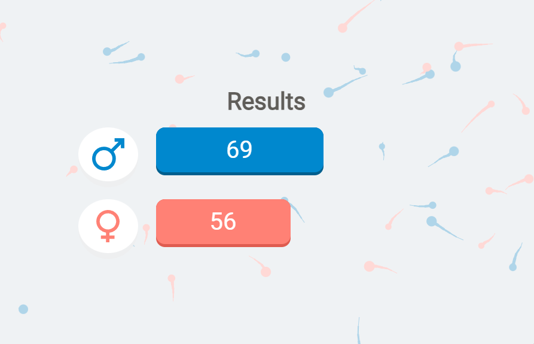
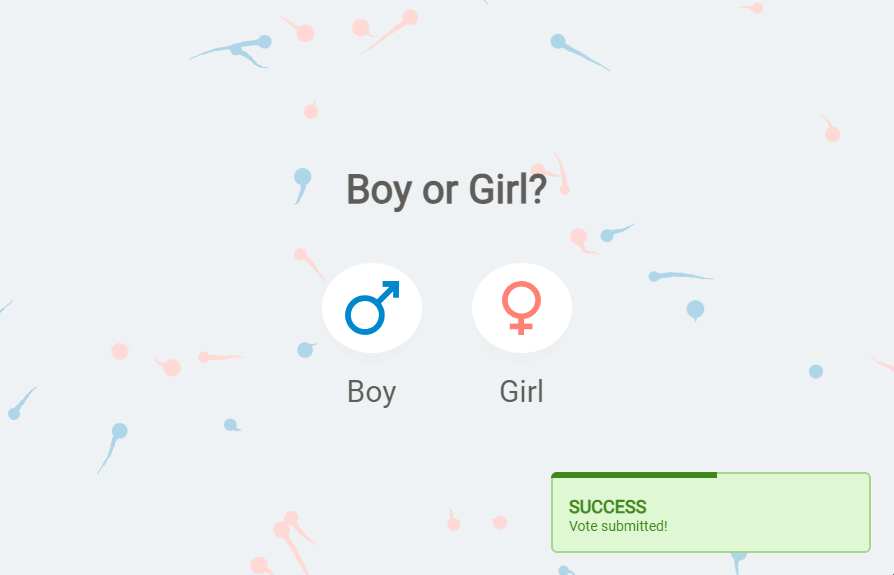

# Baby Poll
 - Simple app for a gender reveal poll
 - Composed of client and server components
 - The client is a [Vue.js](https://vuejs.org/) app and the server is built with Node.js and [Express](https://expressjs.com/)

## Usage
 - Install [node.js](https://nodejs.org/) and [npm](https://www.npmjs.com/)
 - Clone the repository
 - Run `npm install` in the project directory
 - To run the client app, run `npm run start` 
 - To run the server, run `npm run server`

## License
 - The project is distributed under [MIT](https://opensource.org/licenses/MIT), available in the LICENSE file
